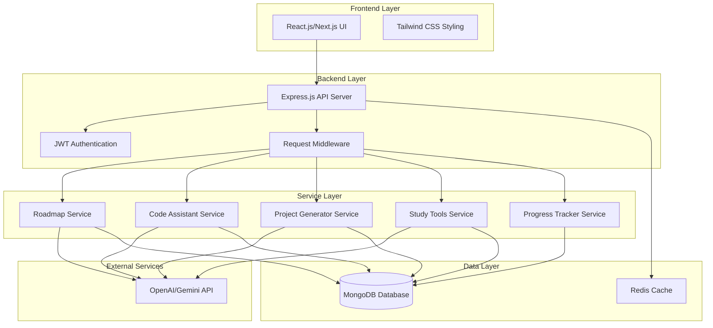

# Design Document

## Overview

SkillForge AI is designed as a modern, scalable web application following a three-tier architecture pattern. The system leverages AI APIs for intelligent features while maintaining a clean separation between frontend presentation, backend business logic, and data persistence layers. The architecture is optimized for rapid development and deployment suitable for hackathon environments while maintaining production-ready practices.

## Architecture

### High-Level Architecture



### Technology Stack

**Frontend:**
- React.js 18+ with Next.js 14 for server-side rendering and routing
- Tailwind CSS for responsive, utility-first styling
- Axios for HTTP client communication
- React Query for state management and caching

**Backend:**
- Node.js with Express.js framework
- JWT for stateless authentication
- Mongoose ODM for MongoDB integration
- Express middleware for request validation and error handling

**Database:**
- MongoDB for document-based data storage
- Redis for session caching and API response caching

**AI Integration:**
- OpenAI GPT-4 or Gemini Pro API for natural language processing
- Custom prompt engineering for domain-specific responses

**Deployment:**
- Vercel for frontend deployment
- AWS EC2 or Railway for backend deployment
- MongoDB Atlas for managed database hosting

## Components and Interfaces

### Frontend Components

**Authentication Components:**
- `LoginForm`: User login interface with form validation
- `RegisterForm`: User registration with profile setup
- `ProtectedRoute`: Route wrapper for authenticated access

**Dashboard Components:**
- `UserDashboard`: Main landing page with progress overview
- `SkillRoadmapView`: Interactive roadmap visualization
- `ProgressChart`: Visual progress tracking with charts
- `QuickActions`: Shortcuts to main features

**Feature Components:**
- `CodeAssistant`: Code input and AI explanation interface
- `ProjectGenerator`: Skill-based project suggestion interface
- `StudyToolsPanel`: Quiz, summary, and flashcard generation
- `RoadmapBuilder`: Interactive roadmap creation and editing

### Backend API Endpoints

**Authentication Endpoints:**
```
POST /api/auth/register - User registration
POST /api/auth/login - User authentication
POST /api/auth/refresh - Token refresh
GET /api/auth/profile - Get user profile
PUT /api/auth/profile - Update user profile
```

**Roadmap Endpoints:**
```
POST /api/roadmaps/generate - Generate personalized roadmap
GET /api/roadmaps/:userId - Get user roadmaps
PUT /api/roadmaps/:id - Update roadmap progress
DELETE /api/roadmaps/:id - Delete roadmap
```

**Code Assistant Endpoints:**
```
POST /api/code/explain - Explain code functionality
POST /api/code/debug - Debug and fix code issues
GET /api/code/history/:userId - Get code assistance history
```

**Project Generator Endpoints:**
```
POST /api/projects/generate - Generate project ideas
GET /api/projects/:userId - Get saved projects
POST /api/projects/save - Save project idea
PUT /api/projects/:id/complete - Mark project as completed
```

**Study Tools Endpoints:**
```
POST /api/study/quiz - Generate quiz from content
POST /api/study/summary - Generate content summary
POST /api/study/flashcards - Generate flashcards
GET /api/study/materials/:userId - Get saved study materials
```

**Progress Tracking Endpoints:**
```
GET /api/progress/:userId - Get user progress data
POST /api/progress/update - Update skill progress
GET /api/progress/analytics/:userId - Get learning analytics
```

### Service Layer Architecture

**RoadmapService:**
- `generateRoadmap(skills, goals)`: Creates personalized learning paths
- `updateProgress(userId, milestoneId)`: Updates completion status
- `getRecommendations(currentSkills)`: Suggests next learning steps

**CodeAssistantService:**
- `explainCode(code, language)`: Provides code explanations
- `debugCode(code, error)`: Identifies and fixes bugs
- `suggestImprovements(code)`: Recommends best practices

**ProjectGeneratorService:**
- `generateProjects(skills, difficulty)`: Creates project suggestions
- `getProjectDetails(projectId)`: Retrieves implementation guidance
- `trackProjectCompletion(userId, projectId)`: Updates project status

**StudyToolsService:**
- `generateQuiz(content, difficulty)`: Creates interactive quizzes
- `createSummary(content)`: Generates key point summaries
- `buildFlashcards(content)`: Creates study flashcards

**ProgressTrackerService:**
- `updateSkillLevel(userId, skill, progress)`: Updates skill proficiency
- `generateReport(userId, timeframe)`: Creates progress reports
- `calculateAchievements(userId)`: Determines earned achievements

## Data Models

### User Model
```javascript
{
  _id: ObjectId,
  email: String (unique, required),
  password: String (hashed, required),
  profile: {
    name: String (required),
    currentSkills: [String],
    careerGoals: [String],
    experienceLevel: String (enum: ['beginner', 'intermediate', 'advanced']),
    preferredLanguages: [String],
    learningStyle: String (enum: ['visual', 'auditory', 'kinesthetic', 'mixed'])
  },
  createdAt: Date,
  updatedAt: Date,
  lastLogin: Date
}
```

### Roadmap Model
```javascript
{
  _id: ObjectId,
  userId: ObjectId (ref: 'User'),
  title: String (required),
  description: String,
  targetSkills: [String],
  milestones: [{
    id: String,
    title: String,
    description: String,
    skills: [String],
    resources: [{
      type: String (enum: ['article', 'video', 'course', 'practice']),
      title: String,
      url: String,
      estimatedTime: Number
    }],
    completed: Boolean (default: false),
    completedAt: Date,
    order: Number
  }],
  estimatedDuration: Number, // in weeks
  difficulty: String (enum: ['beginner', 'intermediate', 'advanced']),
  progress: Number (default: 0), // percentage
  createdAt: Date,
  updatedAt: Date
}
```

### CodeAssistance Model
```javascript
{
  _id: ObjectId,
  userId: ObjectId (ref: 'User'),
  type: String (enum: ['explanation', 'debug', 'improvement']),
  input: {
    code: String (required),
    language: String (required),
    error: String // for debug type
  },
  output: {
    explanation: String,
    suggestions: [String],
    fixedCode: String,
    learningPoints: [String]
  },
  feedback: {
    helpful: Boolean,
    rating: Number (1-5)
  },
  createdAt: Date
}
```

### Project Model
```javascript
{
  _id: ObjectId,
  userId: ObjectId (ref: 'User'),
  title: String (required),
  description: String (required),
  requiredSkills: [String],
  technologies: [String],
  difficulty: String (enum: ['beginner', 'intermediate', 'advanced']),
  estimatedTime: String,
  features: [String],
  implementation: {
    steps: [String],
    resources: [String],
    tips: [String]
  },
  status: String (enum: ['saved', 'in_progress', 'completed']),
  completedAt: Date,
  createdAt: Date,
  updatedAt: Date
}
```

### StudyMaterial Model
```javascript
{
  _id: ObjectId,
  userId: ObjectId (ref: 'User'),
  type: String (enum: ['quiz', 'summary', 'flashcards']),
  sourceContent: String,
  title: String (required),
  content: {
    // For quizzes
    questions: [{
      question: String,
      options: [String],
      correctAnswer: Number,
      explanation: String
    }],
    // For summaries
    keyPoints: [String],
    mainConcepts: [String],
    // For flashcards
    cards: [{
      front: String,
      back: String,
      difficulty: String
    }]
  },
  settings: {
    difficulty: String,
    questionCount: Number,
    includeCode: Boolean
  },
  usage: {
    timesAccessed: Number (default: 0),
    lastAccessed: Date,
    averageScore: Number
  },
  createdAt: Date,
  updatedAt: Date
}
```

### Progress Model
```javascript
{
  _id: ObjectId,
  userId: ObjectId (ref: 'User'),
  skills: [{
    name: String,
    level: Number (0-100),
    lastUpdated: Date,
    milestones: [String]
  }],
  achievements: [{
    id: String,
    title: String,
    description: String,
    earnedAt: Date,
    category: String
  }],
  statistics: {
    totalLearningTime: Number, // in minutes
    projectsCompleted: Number,
    quizzesCompleted: Number,
    currentStreak: Number, // in days
    longestStreak: Number
  },
  weeklyGoals: [{
    week: Date,
    goals: [String],
    completed: [Boolean]
  }],
  createdAt: Date,
  updatedAt: Date
}
```

## Correctness Properties

*A property is a characteristic or behavior that should hold true across all valid executions of a system-essentially, a formal statement about what the system should do. Properties serve as the bridge between human-readable specifications and machine-verifiable correctness guarantees.*

### Property Reflection

After analyzing all acceptance criteria, I identified several areas where properties can be consolidated to eliminate redundancy:

- Authentication properties (1.1, 1.2, 1.4) can be combined into comprehensive authentication flow testing
- Data persistence properties (1.5, 7.1, 7.5) share common validation patterns
- AI service properties (3.1, 3.2, 5.1, 5.2, 5.3) follow similar input-output validation patterns
- Progress tracking properties (2.3, 4.5, 6.1) all test skill level updates
- UI feedback properties (9.4, 9.5, 10.2) test user interface responsiveness

### Core Properties

**Property 1: Authentication Flow Integrity**
*For any* valid user credentials, the authentication process should create accounts, generate valid JWT tokens, and properly handle session expiration
**Validates: Requirements 1.1, 1.2, 1.4**

**Property 2: Data Persistence Consistency**
*For any* user data operation (create, update, delete), the system should immediately persist changes to MongoDB and maintain data integrity across all features
**Validates: Requirements 1.5, 7.1, 7.5**

**Property 3: Roadmap Generation Completeness**
*For any* combination of user skills and career goals, generated roadmaps should include milestones, estimated completion times, difficulty levels, and relevant technologies
**Validates: Requirements 2.1, 2.2, 2.5**

**Property 4: Progress Tracking Accuracy**
*For any* completed learning activity, milestone, or project, the progress tracker should accurately update skill levels, statistics, and unlock appropriate next steps
**Validates: Requirements 2.3, 4.5, 6.1**

**Property 5: AI Service Response Validation**
*For any* AI service request (code explanation, debugging, content generation), the system should return structured responses with educational content, handle errors gracefully, and store interactions for future reference
**Validates: Requirements 3.1, 3.2, 3.3, 3.5, 5.1, 5.2, 5.3**

**Property 6: Multi-Language Code Support**
*For any* supported programming language (JavaScript, Python, Java, C++), the code assistant should process and analyze code correctly regardless of language syntax
**Validates: Requirements 3.4**

**Property 7: Project Generation Relevance**
*For any* user skill set, generated projects should be relevant to those skills, include complete descriptions, technology requirements, difficulty levels, and implementation guidance
**Validates: Requirements 4.1, 4.2, 4.3**

**Property 8: Study Material Customization**
*For any* study material generation request, the system should respect user customization settings for difficulty, question types, and content focus while maintaining educational quality
**Validates: Requirements 5.4**

**Property 9: Study Material Persistence**
*For any* generated study material (quiz, summary, flashcard), the system should save it for future access and allow users to organize and retrieve materials efficiently
**Validates: Requirements 4.4, 5.5**

**Property 10: Progress Visualization Completeness**
*For any* user dashboard or progress view, the system should display visual representations of skill growth, learning streaks, completed projects, achievements, and upcoming goals
**Validates: Requirements 6.2, 6.3, 6.5**

**Property 11: Report Generation Insights**
*For any* progress report generation, the system should provide meaningful insights, recommendations, and actionable next steps based on user learning patterns
**Validates: Requirements 6.4**

**Property 12: Security and Encryption**
*For any* sensitive user data (passwords, personal information), the system should encrypt data before storage and maintain security throughout all operations
**Validates: Requirements 7.2**

**Property 13: Error Handling Gracefully**
*For any* system error or failure condition, the system should handle errors gracefully, provide user-friendly messages with suggested actions, and maintain system stability
**Validates: Requirements 7.3, 9.5**

**Property 14: AI Service Resilience**
*For any* AI API interaction, the system should handle rate limiting, service unavailability, implement retry mechanisms, and provide fallback responses when needed
**Validates: Requirements 8.1, 8.2**

**Property 15: Content Validation and Logging**
*For any* AI-generated content, the system should validate and sanitize responses before display and log all interactions for debugging and improvement purposes
**Validates: Requirements 8.3, 8.5**

**Property 16: Responsive Design Adaptation**
*For any* screen size or device type, the user interface should adapt responsively and maintain usability across all supported devices
**Validates: Requirements 9.2**

**Property 17: UI Feedback Responsiveness**
*For any* asynchronous operation, the system should provide appropriate loading states, progress indicators, and complete operations within specified time limits
**Validates: Requirements 9.4, 10.2**

**Property 18: Performance Under Load**
*For any* standard user operation, the system should respond within 2 seconds and maintain performance stability under concurrent user load up to 100 users
**Validates: Requirements 10.1, 10.3, 10.5**

**Property 19: Caching Effectiveness**
*For any* frequently accessed data or AI response, the caching system should improve response times and reduce redundant processing
**Validates: Requirements 10.4**

## Error Handling

### Error Categories and Responses

**Authentication Errors:**
- Invalid credentials: Return 401 with clear error message
- Expired tokens: Return 401 and redirect to login
- Missing tokens: Return 401 and prompt for authentication

**Validation Errors:**
- Invalid input data: Return 400 with field-specific error messages
- Missing required fields: Return 400 with list of missing fields
- Data format errors: Return 400 with format requirements

**AI Service Errors:**
- API rate limiting: Implement exponential backoff and queue requests
- Service unavailable: Provide cached responses or fallback messages
- Invalid responses: Sanitize content and log for review

**Database Errors:**
- Connection failures: Retry with exponential backoff
- Query errors: Log error and return generic failure message
- Data corruption: Implement data validation and recovery procedures

**Performance Errors:**
- Timeout errors: Cancel operations and notify users
- Memory issues: Implement request throttling and resource monitoring
- High load: Enable graceful degradation of non-essential features

### Error Recovery Strategies

**Automatic Recovery:**
- Retry failed API calls with exponential backoff
- Reconnect to database on connection loss
- Clear corrupted cache entries automatically

**User-Guided Recovery:**
- Provide clear error messages with suggested actions
- Offer alternative workflows when primary features fail
- Allow users to retry operations manually

**System Monitoring:**
- Log all errors with context for debugging
- Monitor error rates and alert on anomalies
- Track user impact and prioritize fixes accordingly

## Testing Strategy

### Dual Testing Approach

The testing strategy employs both unit testing and property-based testing to ensure comprehensive coverage:

**Unit Tests:**
- Focus on specific examples, edge cases, and error conditions
- Test individual components and functions in isolation
- Verify integration points between system components
- Validate specific user scenarios and workflows

**Property-Based Tests:**
- Verify universal properties across all possible inputs
- Use randomized input generation to discover edge cases
- Test system behavior under various conditions
- Validate correctness properties defined in this document

### Property-Based Testing Configuration

**Testing Framework:** 
- Frontend: Use `fast-check` library for JavaScript/TypeScript property testing
- Backend: Use `fast-check` for Node.js property testing
- Database: Use property tests for data model validation

**Test Configuration:**
- Minimum 100 iterations per property test
- Each property test references its corresponding design document property
- Tag format: **Feature: skillforge-ai, Property {number}: {property_text}**

**Property Test Implementation:**
- Each correctness property must be implemented by a single property-based test
- Tests should generate random valid inputs within domain constraints
- Assertions should verify the universal property holds for all generated inputs
- Failed tests should provide clear counterexamples for debugging

### Testing Priorities

**High Priority (Core Functionality):**
1. Authentication and user management
2. AI service integration and response handling
3. Data persistence and retrieval
4. Progress tracking accuracy

**Medium Priority (User Experience):**
1. UI responsiveness and error handling
2. Content generation quality
3. Performance under normal load

**Low Priority (Edge Cases):**
1. Extreme load testing
2. Network failure scenarios
3. Browser compatibility edge cases

### Test Data Management

**Test Data Generation:**
- Use property-based testing libraries to generate realistic test data
- Create factories for complex domain objects (users, roadmaps, projects)
- Implement data cleanup procedures for integration tests
- Use separate test databases to avoid contaminating production data

**Mock Services:**
- Mock AI API responses for consistent testing
- Implement test doubles for external dependencies
- Use dependency injection to swap implementations during testing
- Create realistic mock data that represents actual API responses